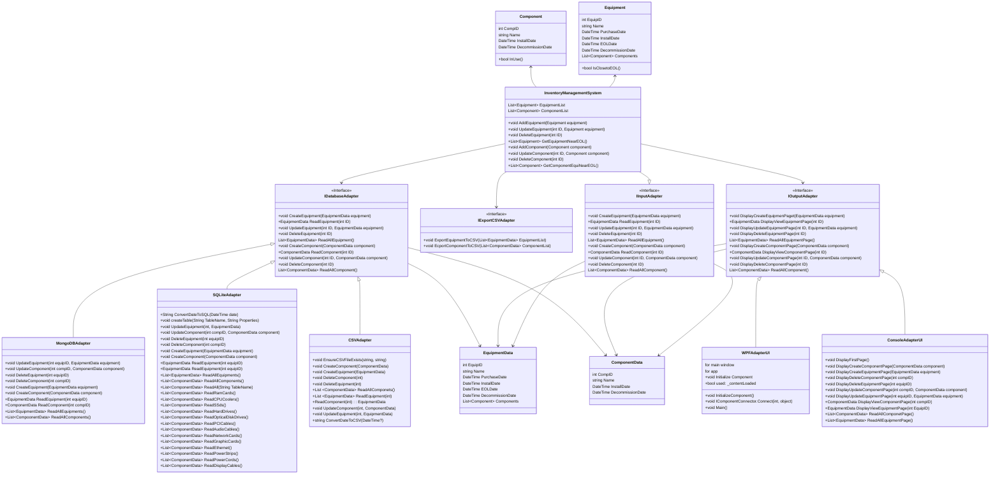

```mermaid
classDiagram
Equipment <-- InventoryManagementSystem
Component <-- InventoryManagementSystem
InventoryManagementSystem --> IDatabaseAdapter
IDatabaseAdapter <|-- MongoDBAdapter
IDatabaseAdapter <|-- SQLiteAdapter
IDatabaseAdapter <|-- CSVAdapter
InventoryManagementSystem --> IExportCSVAdapter
InventoryManagementSystem --|> IInputAdapter
IOutputAdapter <|-- WPFAdapterUI
IOutputAdapter <|-- ConsoleAdapterUI
IInputAdapter --> EquipmentData
IInputAdapter --> ComponentData
IOutputAdapter --> ComponentData
IOutputAdapter --> EquipmentData
IDatabaseAdapter --> EquipmentData
IDatabaseAdapter --> ComponentData
InventoryManagementSystem --> IOutputAdapter

class Equipment {  
    int EquipID
    string Name
    DateTime PurchaseDate
    DateTime InstallDate
    DateTime EOLDate
    DateTime DecommissionDate
    List~Component~ Components

    +bool IsClosetoEOL()
}

class Component {
    int CompID
    string Name
    DateTime InstallDate
    DateTime DecommissionDate

    +bool InUse()
}
class EquipmentData {  
    int EquipID
    string Name
    DateTime PurchaseDate
    DateTime InstallDate
    DateTime EOLDate
    DateTime DecommissionDate
    List~Component~ Components
}

class ComponentData {
    int CompID
    string Name
    DateTime InstallDate
    DateTime DecommissionDate
}

class InventoryManagementSystem {
    List~Equipment~ EquipmentList
    List~Component~ ComponentList

    +void AddEquipment(Equipment equipment)
    +void UpdateEquipment(int ID, Equipment equipment)
    +void DeleteEquipment(int ID)
    +List~Equipment~ GetEquipmentNearEOL()

    +void AddComponent(Component component)
    +void UpdateComponent(int ID, Component component)
    +void DeleteComponent(int ID)
    +List~Component~ GetComponentEquiNearEOL()
}

class IDatabaseAdapter {
    <<Interface>>
    +void CreateEquipment(EquipmentData equipment)
    +EquipmentData ReadEquipment(int ID)
    +void UpdateEquipment(int ID, EquipmentData equipment)
    +void DeleteEquipment(int ID)
    List~EquipmentData~ ReadAllEquipment()

    +void CreateComponent(ComponentData component)
    +ComponentData ReadComponent(int ID)
    +void UpdateComponent(int ID, ComponentData component)
    +void DeleteComponent(int ID)
    List~ComponentData~ ReadAllComponent()
}

class IInputAdapter {
    <<Interface>>
    +void CreateEquipment(EquipmentData equipment)
    +EquipmentData ReadEquipment(int ID)
    +void UpdateEquipment(int ID, EquipmentData equipment)
    +void DeleteEquipment(int ID)
    List~EquipmentData~ ReadAllEquipment()

    +void CreateComponent(ComponentData component)
    +ComponentData ReadComponent(int ID)
    +void UpdateComponent(int ID, ComponentData component)
    +void DeleteComponent(int ID)
    List~ComponentData~ ReadAllComponent()
}

class IOutputAdapter {
    <<Interface>>
    +void DisplayCreateEquipmenPaget(EquipmentData equipment)
    +EquipmentData DisplayViewEquipmentPage(int ID)
    +void DisplayUpdateEquipmentPage(int ID, EquipmentData equipment)
    +void DisplayDeleteEquipmentPage(int ID)
    List~EquipmentData~ ReadAllEquipmentPage()

    +void DisplayCreateComponentPage(ComponentData component)
    +ComponentData DisplayViewComponentPage(int ID)
    +void DisplayUpdateComponentPage(int ID, ComponentData component)
    +void DisplayDeleteComponentPage(int ID)
    List~ComponentData~ ReadAllComponent()
}

class IExportCSVAdapter {
    <<Interface>>
    +void ExportEquipmentToCSV(List~EquipmentData~ EquipmentList)
    +void EcportComponentToCSV(List~ComponentData~ ComponentList)
}

class CSVAdapter {
    +void EnsureCSVFileExists(string, string)
    +void CreateComponent(ComponentData)
    +void CreateEquipment(EquipmentData)
    +void DeleteComponent(int)
    +void DeleteEquipment(int)
    +List ~ComponentData~ ReadAllComponets()
    +List ~EquipmentData~ ReadEquipment(int)
    +ReadComponent(int): EquipmentData
    +void UpdateComponent(int, ComponentData)
    +void UpdateEquipment(int, EquipmentData)
    +string ConvertDateToCSV(DateTime?)
}

class SQLiteAdapter{
    +String ConvertDateToSQL(DateTime date)
    +void createTable(String TableName, String Properties)
    +void UpdateEquipment(int, EquipmentData)
    +void UpdateComponent(int compID, ComponentData component)
    +void DeleteEquipment(int equipID)
    +void DeleteComponent(int compID)
    +void CreateEquipment(EquipmentData equipment)
    +void CreateComponent(ComponentData component)
    +EquipmentData ReadEquipment(int equipID)
    +EquipmentData ReadEquipment(int equipID)
    +List~EquipmentData~ ReadAllEquipments()
    +List~ComponentData~ ReadAllComponents()
    +List~ComponentData~ ReadAll(String TableName)
    +List~ComponentData~ ReadRamCards()
    +List~ComponentData~ ReadCPUCoolers()
    +List~ComponentData~ ReadSSds()
    +List~ComponentData~ ReadHardDrives()
    +List~ComponentData~ ReadOpticalDiskDrives()
    +List~ComponentData~ ReadPCICables()
    +List~ComponentData~ ReadAudioCables()
    +List~ComponentData~ ReadNetworkCards()
    +List~ComponentData~ ReadGraphicCards()
    +List~ComponentData~ ReadEthernet()
    +List~ComponentData~ ReadPowerStrips()
    +List~ComponentData~ ReadPowerCords()
    +List~ComponentData~ ReadDisplayCables()
}

class MongoDBAdapter {
    +void UpdateEquipment(int equipID, EquipmentData equipment)
    +void UpdateComponent(int compID, ComponentData component)
    +void DeleteEquipment(int equipID)
    +void DeleteComponent(int compID)
    +void CreateEquipment(EquipmentData equipment)
    +void CreateComponent(ComponentData component)
    +EquipmentData ReadEquipment(int equipID)
    +ComponentData ReadComponent(int compID)
    +List~EquipmentData~ ReadAllEquipments()
    +List~CompoonentData~ ReadAllComponents()
}

class ConsoleAdapterUI{
    +void DisplayFirstPage()
    +void DisplayCreateComponentPage(ComponentData component)
    +void DisplayCreateEquipmentPage(EquipmentData equipment)
    +void DisplayDeleteComponentPage(int compID)
    +void DisplayDeleteEquipmentPage(int equipID)
    +void DisplayUpdateComponentPage(int compID, ComponentData component)
    +void DisplayUpdateEquipmentPage(int equipID, EquipmentData equipment)
    +ComponentData DisplayViewComponentPage(int compID)
    +EquipmentData DisplayViewEquipmentPage(int EquipID)
    +List~ComponentData~ ReadAllComponetPage()
    +List~EquipmentData~ ReadAllEquipmentPage()
}

class WPFAdapterUI{
for main window
+void InitializeComponent()
+void IComponentConnector.Connect(int, object)
for app
+void Main()
+void Initialize Component

+bool used: _contentLoaded
}

```
