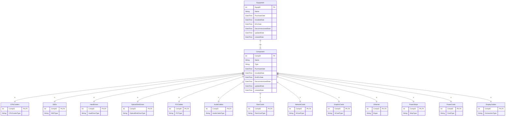

```mermaid
erDiagram
  Component {
    Int CompID PK
    String Name
    String Type
    DateTime PurchaseDate
    DateTime InstalledDate
    DateTime EndOLDate
    DateTime DecommissionedDate
    DateTime updatedDate
    DateTime createdDate
  }
  Equipment {
    Int EquipID PK
    String Name
    DateTime PurchaseDate
    DateTime InstalledDate
    DateTime EOLDate
    DateTime DecommissionedDate
    DateTime updatedDate
    DateTime createdDate
  }
  DisplayCables {
    Int CompID PK, FK
    String ConnectionType
  }
  PowerCords {
    Int CompID PK, FK
    String CordType
  }
  PowerStrips {
    Int CompID PK, FK
    String StripType
  }
  Ethernet {
    Int CompID PK, FK
    String Etype
  }
  GraphicCards {
    Int CompID PK, FK
    String GCardType
  }
  NetworkCards {
    Int CompID PK, FK
    String NCardType
  }
  RamCards {
    Int CompID PK, FK
    String RamCardType
  }
  AudioCables {
    Int CompID PK, FK
    String AudioCableType
  }
  PCICables {
    Int CompID PK, FK
    String PCIType
  }
  OpticalDiskDrives {
    Int CompID PK, FK
    String OpticalDiskDriveType
  }
  HardDrives {
    Int CompID PK, FK
    String HardDriveType
  }
  SSDs {
    Int CompID PK, FK
    String SSDType
  }
  CPUCoolers {
    Int CompID PK, FK
    String CPUCoolerType
  }
  Equipment ||--|{ Component : has
  Component ||--|| CPUCoolers : is
  Component ||--|| SSDs : is
  Component ||--|| HardDrives : is
  Component ||--|| OpticalDiskDrives : is
  Component ||--|| PCICables : is
  Component ||--|| AudioCables : is
  Component ||--|| RamCards : is
  Component ||--|| NetworkCards : is
  Component ||--|| GraphicCards : is
  Component ||--|| Ethernet : is
  Component ||--|| PowerStrips : is
  Component ||--|| PowerCords : is
  Component ||--|| DisplayCables : is
```
